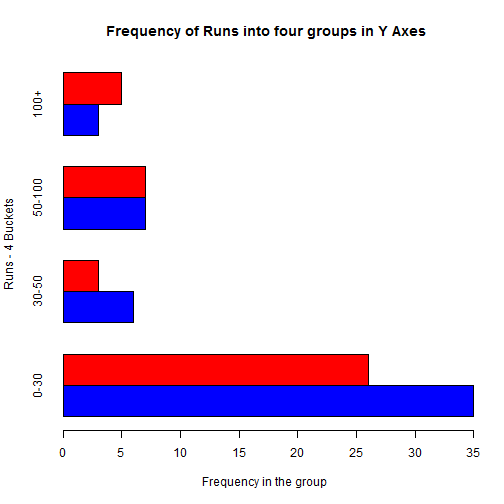

ESPN - Cricket App
========================================================

The objective of the app is to quickly compare two team, and gain a fair idea on which teach has a better chance of winning when they paly against each other.

Data Used in the App
-------------------------
The data used is download from - [Stats Guru - Espn Cricinfo](http://stats.espncricinfo.com/ci/engine/stats/index.html?class=2;spanmin1=21+Feb+2014;spanval1=span;template=results;type=batting;view=innings) using the url function in the R-Package. 


```r
data <- read.csv("data.csv", header = TRUE, sep = ",")
data <- na.omit(data)
head(data)
```

```
##      Player.Name Home.Country Opposite.Country runs Fours Six
## 1      RG Sharma        India        Sri Lanka  264    33   9
## 2       L Ronchi  New Zealand        Sri Lanka  170    14   9
## 3       D Ramdin  West Indies       Bangladesh  169     8  11
## 4        HM Amla South Africa      West Indies  153    14   0
## 5 AB de Villiers South Africa      West Indies  149     9  16
## 6  Sikandar Raza     Zimbabwe      Afghanistan  141    11   7
```

1. Player.Name - Name of the player
2. Home Country - Home Country
3. Opposite.Country - Oponent
4. Runs - The runs scored by a player against {3}
5. Fours - Total number of boundaries hit (4 Runs)
6. Six - Total number of boundaries hit (6 Runs)

How to analyse the data?
-------------------------
Remove the null values using na.rm(data)

### Select Team-A and Team-B 

**Data-A** consist of home country = India and opponent country = Sri Lanka and vice versa for **Data-B**. 


```r
teamA <- "India"
teamB <- "Sri Lanka"

dataA <- data[ which(data$Home.Country == teamA 
                       & data$Opposite.Country == teamB), ]

dataB <- data[ which(data$Home.Country == teamB 
                     & data$Opposite.Country == teamA), ]
```

### The App foucses mainly on the total runs 
From the dataA and dataB we can get the data using appropriate column names to acces them. we can find the sum along the row and store in $totalRunsA   


```r
runsA <- dataA$runs
totalRunsA <- sum(runsA)
totalFoursA <- sum(dataA$Fours)
totalSixA <- sum(dataA$Six)

# collect runs scored by runsB,totalRunsB, totalFoursB, totalSixB
runsB <- dataB$runs
totalRunsB <- sum(runsB)
totalFoursB <- sum(dataB$Fours)
totalSixB <- sum(dataB$Six)
```

### Plotting Total Score (A vs. B)
This should be done using pie chart.

***Inference:*** Any team which is above ***50%*** is a clear indiation that they have some advantage over oponents. 


```r
slices <- c(totalRunsA, totalRunsB)
teamName <- c(teamA,teamB)
percentage <- round(slices/sum(slices)*100)
sliceName <- paste(teamName," ", percentage, "%", sep="")
subLabel <- paste("Total Runs" , totalRunsA, "from feb 2014 - feb 2015")

pie(slices,labels = sliceName, 
    col = c("red","blue"), 
    main = "Total runs socred against each other", sub=subLabel)
```

 
### Creating Buckets to analyse the scores

First we create four variables to store the frequency of runs. applying the which operator on the index we can easily get the count and store them.

we can do a horizontal bar plot or vertical to analyze the team performance in each stage. 


```r
countRunsA30 <- length(runsA[ which( runsA > 0 & runsA < 30)])
countRunsA50 <- length(runsA[ which( runsA > 31 & runsA < 50)])
countRunsA100 <- length(runsA[ which( runsA > 51 & runsA < 100)])
countRunsA100Plus <- length(runsA[ which( runsA > 101)])

countRunsB30 <- length(runsB[ which( runsB > 0 & runsB < 30)])
countRunsB50 <- length(runsB[ which( runsB > 31 & runsB < 50)])
countRunsB100 <- length(runsB[ which( runsB > 51 & runsB < 100)])
countRunsB100Plus <- length(runsB[ which( runsB > 101)])

runsBucketsA =  c(countRunsA30, 
                   countRunsA50,
                   countRunsA100,
                   countRunsA100Plus)

runsBucketsB =  c(countRunsB30, 
                   countRunsB50,
                   countRunsB100,
                   countRunsB100Plus)

runsBucketsAB = rbind(runsBucketsB,runsBucketsA)
colBuckets = c("0-30","30-50", "50-100", "100+")
```

***Inference:*** From the graph we can see that the srilanka and india have same advantage in the 3rd bucket. but the value of India in the 4th bucket is higher. From this we can inter that indian can convert more centuries against srilanka. Hence a significant advantage over srilanka.


```r
barplot(runsBucketsAB, main="Frequency of Runs into four groups in Y Axes", beside=TRUE, horiz=TRUE,
        names.arg=colBuckets, col=c("blue","red"),
        xlab=" Frequency in the group  ", ylab="Runs - 4 Buckets")
```

 
